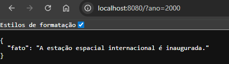

# API Fatos Históricos



API REST desenvolvida com Node.js e Express que retorna fatos históricos com base no ano informado na requisição.

---

## Tecnologias utilizadas

- Node.js
- Express
- JavaScript

---

## Funcionalidades

- Busca de fatos históricos por ano
- Validação de parâmetros
- Retorno de dados em JSON
- Estrutura de API REST

---

## Como executar o projeto

### Clone o repositório

```bash
git clone https://github.com/SEU-USUARIO/api-fatos-historicos.git
```

---

### Acesse a pasta do projeto

```bash
cd api-fatos-historicos
```

---

### Instale as dependências

```bash
npm install
```

---

### Execute o servidor

```bash
node index.js
```

ou

```bash
npm start
```

---

## Como utilizar a API

A API utiliza query params para buscar fatos históricos.

### Exemplo de requisição

```http
GET http://localhost:8080/?ano=1999
```

---

## Exemplo de resposta

```json
{
  "fato": "Descrição do fato histórico."
}
```

---

## Exemplo de erro

```json
{
  "erro": "Parâmetro ano inválido"
}
```

---

## Estrutura do projeto

```txt
api-fatos-historicos/
├── assets/
│   └── preview.png
│
├── dados/
│   └── fatos.js
│
├── servico/
│   └── servico.js
│
├── node_modules/
│
├── index.js
├── package.json
├── package-lock.json
└── README.md
```

---

## Objetivo do projeto

Projeto desenvolvido para prática de desenvolvimento back-end utilizando Node.js, Express, rotas HTTP e manipulação de dados em APIs REST.

---
